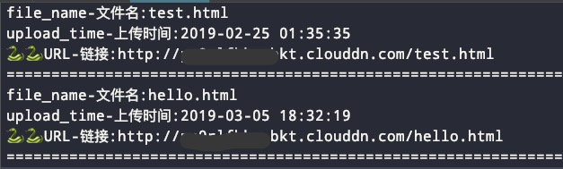

<h3 align='center'>Seven Cow Note 七牛云笔记</h3>
-一个利用七牛云储存创建的云笔记python脚本

# 开发环境
- 基于``python3.6``
- ``macos``

# 准备
- 去七牛云注册账号，创建仓库，免费仓库为``10G``，够用啦！
- 优点：

	1. 配合sh脚本上传，贼舒服
	2. 空间大
	3. 一些笔记应用免费版储存空间小
	4. 传输速度快
	5. 支持各种格式文件

# Installing
- 需要安装七牛的依赖包
> $ pip install qiniu

## 文件目录说明
1. ``logs.txt``: 记录上传数据

2. ``main.py``: 项目主程序
3. ``notes``目录: 笔记存放目录
4. ``utils``:程序运行包
5. ``readme.md``： 项目说明文件
6. ``settings``：配置文件，项目所有配置都在这里面，一定要配置

7. ``note.py``：项目运行程序，如果想研究的可以看一下
8. ``write_msg.py``:封装的打印函数

## 克隆仓库到本地
> $ git clone https://github.com/CriseLYJ/seven_cow_note.git

## 进入项目目录
> $ cd 你克隆到的目录

## 运行程序
1. 打开``utils/settings.py``
	- 修改：``ACCESS_KEY``--你的ak
	- 修改: ``SECRET_KEY``--你的sk
	- 修改：``QINIU_URL``--你的七牛默认域名
	
	
2. 保存
3. 在终端中运行你的代码
> python main.py
4. 输入你要上传文件的本地链接地址
	- 这里你可以将你的笔记放入notes文件夹中
	> $ notes/你的笔记全称

# 大功告成啦
- 显示以下信息说明上传成功了

- 此时打开``logs.txt``，里面包含你上传的信息，和你上传的时间

- 此时可以访问``logs.txt``中记录的``url``，你的一个笔记文件就出来啦~

