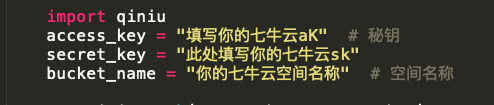
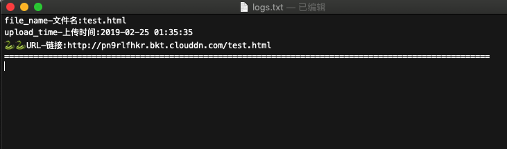

# Seven Cow Note 七牛云笔记
- 一个七牛云储存Python SDK
-一个利用七牛云储存创建的云笔记python脚本

## 开发环境
- 基于``python3.6``
- 需要安装七牛的包
> $ pip install qiniu

## 文件
1. logs.txt: 记录上传数据
2. note.py: 项目主程序
3. notes目录: 笔记存放目录
4. pic: readme截图
5. readme.md： 项目说明文件

## 克隆仓库到本地
> $ git clone 链接

## 进入项目目录
> $ cd 你克隆到的目录

## 运行程序
1. 打开``note.py``
	- 修改：``ACCESS_KEY``--你的ak
	- 修改: ``SECRET_KEY``--你的sk
	
	
	- 修改：``QINIU_URL``--你的七牛默认域名
	
	
2. 保存
3. 在终端中运行你的代码
> python note.py
4. 输入你要上传文件的本地链接地址
	- 这里你可以将你的笔记放入notes文件夹中
	> $ notes/你的笔记全称

`` 一段等待......

## 大功告成啦
- 此时打开``logs.txt``，里面包含你上传的信息，和你上传的时间

## 等待后期更新
- 目前只是一个很糙的脚本啦！正在更新哦。。。。。
- 如果有帮到你记得给个``star`
- 在这里感谢！！！